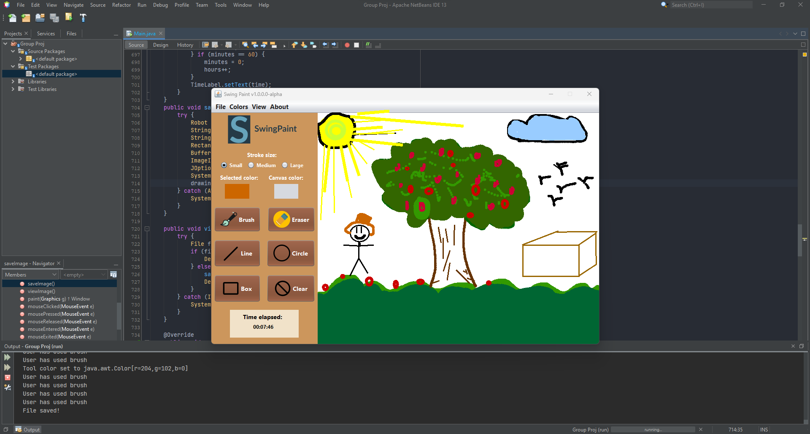

# SwingPaint
\
GUI paint app made with Java Swing

CS128-8L_BM5 Group Project 1Q2022\
This is a **group** project!

## **Project Attribution**

**Please Note:** I did not build the entire project on my own. This project was a collaborative effort, and I want to acknowledge and give credit to the team members who contributed to its development. Each team member played a crucial role in bringing this project to life.

### Members: 
 * LARA, CHARLENE GRAZIELLE - Project leader
 * DELFIN, IVAN ZACHARRIA - Frontend
 * GARCIA, ERVIN MIKHAIL - Frontend
 * INOCENCIO, ZARA NAOMI - Frontend
 * TAYAG, DYLAN LOUIS - Backend 
 
&nbsp;
&nbsp;
&nbsp;

# Sample

&nbsp;
&nbsp;
&nbsp;

# How to run:
1. Download the .zip file\
   https://github.com/ghandylan/SwingPaint/archive/refs/heads/master.zip or https://drive.google.com/file/d/1LxAQUKbvp5sjYkLbib0O8vuT9ax_jYw2/view?usp=sharing
2. Unzip the downloaded file (SwingPaint-master.zip)
3. Open the project in netbeans\
   Run Main.java
4. Enjoy :D
